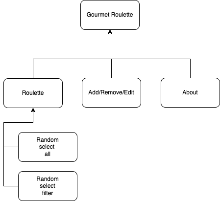

#Deployed URL
https://whispering-chamber-68869.herokuapp.com/

# Building and installing Gourmet Roulette
1. git clone `https://github.com/nyu-csci-ua-0467-001-002-spring-2022/final-project-charliecai00`
2. Navigate into the project directory
3. Create .env 
4. Copy the code into .env 
```
MONGODB_URI = "//Your Mongodb Atlas Server"
```
5. run `npm install`
6. run `npm start`


# Gourmet Roulette

## Overview

There are over ten thousands restaurants in Manhattan, New York. Which restaurants will you have dinner at? It's just one of those anxious daily questions that you have just hours before dinner. Should I choose a restaurant in downtown, midtown, or uptown? What type of cuisine should I pick, probably not Italian cuz I just had it last night? Sounds annoying enough... 

Gourmet Roulette chooses the restaurant for you using math (just fancy word for random). Different to Yelp which recommends a list of restaurant bases on search keyword. Using Gourmet Roulette, the user can edit the list of starred restaurants. Liked the restaurant? Add the restaurant to the list. Tried and disliked the restaurant? Get rid of it. The user can categorize the restaurant by district and the type of cuisine. Open Gourmet Roulette and roll the dice, the app randomly selects the restaurant for the user based on the user's filter setting. 


## Data Model

The application uses Mongo Atlas to store collections: restaurants

An Example:

```json
[
  {
    "name": "Curabitur nibh", 
    "district": "nec mi in", 
    "cuisine": "Fusce erat tortor"
  }, 
  { 
    "name": "Cauctor a libero quis",
    "district": "Aliquam", 
    "cuisine": "quis ultricies"
  }
]
```


## [Link to Commented First Draft Schema](Archive/db.js)

## Wireframes

main page


favorite page


about page


## Site map



## User Stories

1. As a user, I want the outcome drawn from entire list or selected categories so that I can narrow my options.
2. As a user, I want to add restaurants to the list so that when I discover a new restaurant I can revisit them.
3. As a user, I want to remove restaurants from the list so that if I don't like them I won't go again.
4. As a user, I want to edit the restaurants details so that I can put restaurants in different categories.
5. As a user, I want to register for an account so that my restaurants list is stored in a database.

## Research Topics

* (4 points) Heroku + MongoDB
* (4 points) Unit testing with JavaScript
* (2 points) Integrate ESLint into the workflow

## [Link to Initial Main Project File](Archive/app.js)

## Annotations / References Used

Null

