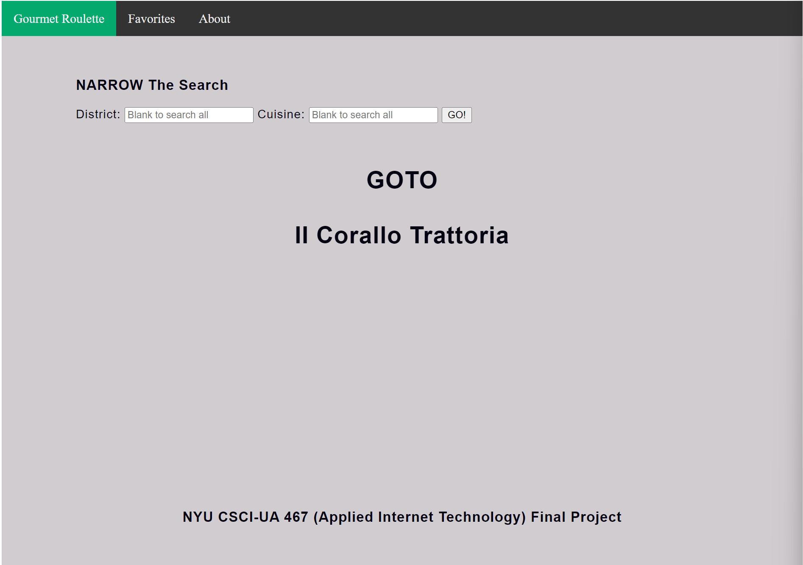
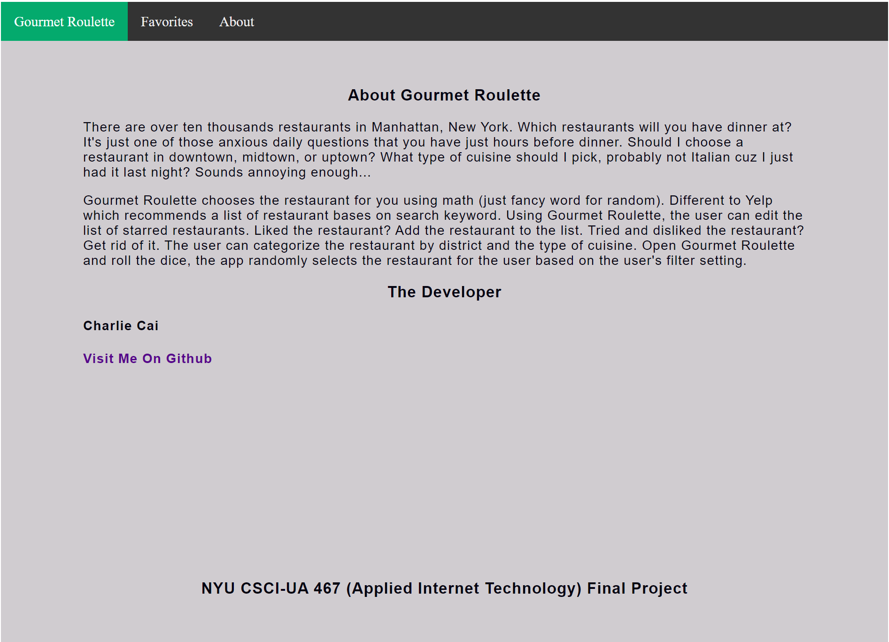

# Gourmet Roulette

### [Deployed URL](https://whispering-chamber-68869.herokuapp.com/)

## Overview
There are over ten thousands restaurants in Manhattan, New York. Which restaurants will you have dinner at? It's just one of those anxious daily questions that you have just hours before dinner. Should I choose a restaurant in downtown, midtown, or uptown? What type of cuisine should I pick, probably not Italian cuz I just had it last night? Sounds annoying enough... 

Gourmet Roulette chooses the restaurant for you using math (just fancy word for random). Different to Yelp which recommends a list of restaurant bases on search keyword. Using Gourmet Roulette, the user can edit the list of starred restaurants. Liked the restaurant? Add the restaurant to the list. Tried and disliked the restaurant? Get rid of it. The user can categorize the restaurant by district and the type of cuisine. Open Gourmet Roulette and roll the dice, the app randomly selects the restaurant for the user based on the user's filter setting. 

## Building and installing Gourmet Roulette
1. git clone `https://github.com/nyu-csci-ua-0467-001-002-spring-2022/final-project-charliecai00`
2. Navigate into the project directory
3. Create .env 
4. Copy the code into .env 
```
MONGODB_URI = "//Your Mongodb Atlas Server"
```
5. run `npm install`
6. run `npm start`


## Website Screenshots
### Main page


### Favorites page


### About page



